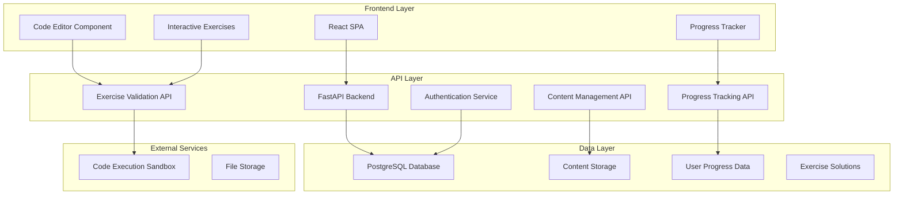

# Design Document

## Overview

The Web Frameworks Tutorial Platform is designed as a modern, interactive learning management system specifically tailored for teaching Flask, FastAPI, and PostgreSQL. The platform will feature a modular architecture that supports progressive learning, hands-on coding exercises, and real-time feedback. The system will be built using FastAPI as the backend API, React for the frontend, and PostgreSQL for data persistence, creating a practical demonstration of the technologies being taught.

## Architecture

### High-Level Architecture



### Technology Stack

- **Frontend**: React 18 with TypeScript, Tailwind CSS, Monaco Editor for code editing
- **Backend**: FastAPI with Python 3.11+, SQLAlchemy ORM, Alembic for migrations
- **Database**: PostgreSQL 15+ with proper indexing and optimization
- **Authentication**: JWT tokens with refresh token rotation
- **Code Execution**: Docker containers for safe code execution
- **Deployment**: Docker containers with nginx reverse proxy

## Components and Interfaces

### Frontend Components

#### 1. Learning Dashboard
- **Purpose**: Main navigation and progress overview
- **Key Features**: 
  - Progress visualization across all three technologies
  - Quick access to bookmarked content
  - Recent activity feed
  - Learning path recommendations

#### 2. Lesson Viewer
- **Purpose**: Display tutorial content with interactive elements
- **Key Features**:
  - Markdown rendering with syntax highlighting
  - Embedded code examples
  - Interactive diagrams and visualizations
  - Navigation between lesson sections

#### 3. Code Editor Component
- **Purpose**: In-browser code editing and execution
- **Key Features**:
  - Monaco Editor with Python syntax highlighting
  - Real-time syntax validation
  - Code execution with output display
  - Solution comparison and hints

#### 4. Exercise Manager
- **Purpose**: Handle coding exercises and validation
- **Key Features**:
  - Exercise description and requirements
  - Code submission and validation
  - Automated testing feedback
  - Progress tracking and scoring

### Backend API Endpoints

#### 1. Content Management API
```python
# Core endpoints for tutorial content
GET /api/v1/modules                    # List all learning modules
GET /api/v1/modules/{module_id}        # Get specific module details
GET /api/v1/lessons/{lesson_id}        # Get lesson content
GET /api/v1/exercises/{exercise_id}    # Get exercise details
```

#### 2. User Progress API
```python
# Track and manage user learning progress
GET /api/v1/users/{user_id}/progress   # Get user progress
POST /api/v1/progress/lesson           # Mark lesson as completed
POST /api/v1/progress/exercise         # Submit exercise completion
GET /api/v1/users/{user_id}/bookmarks  # Get bookmarked content
```

#### 3. Exercise Validation API
```python
# Handle code execution and validation
POST /api/v1/exercises/validate        # Validate exercise solution
POST /api/v1/code/execute              # Execute code in sandbox
GET /api/v1/exercises/{id}/hints       # Get exercise hints
```

#### 4. Authentication API
```python
# User authentication and authorization
POST /api/v1/auth/register             # User registration
POST /api/v1/auth/login                # User login
POST /api/v1/auth/refresh              # Refresh JWT token
POST /api/v1/auth/logout               # User logout
```

## Data Models

### Core Data Models

#### User Model
```python
class User:
    id: UUID
    email: str
    username: str
    password_hash: str
    created_at: datetime
    last_login: datetime
    is_active: bool
    profile: UserProfile
```

#### Learning Module Model
```python
class LearningModule:
    id: UUID
    name: str  # "Flask Basics", "FastAPI Advanced", etc.
    description: str
    technology: str  # "flask", "fastapi", "postgresql"
    difficulty_level: str  # "beginner", "intermediate", "advanced"
    order_index: int
    lessons: List[Lesson]
    estimated_duration: int  # in minutes
```

#### Lesson Model
```python
class Lesson:
    id: UUID
    module_id: UUID
    title: str
    content: str  # Markdown content
    order_index: int
    learning_objectives: List[str]
    prerequisites: List[UUID]  # Other lesson IDs
    exercises: List[Exercise]
    estimated_duration: int
```

#### Exercise Model
```python
class Exercise:
    id: UUID
    lesson_id: UUID
    title: str
    description: str
    exercise_type: str  # "coding", "multiple_choice", "fill_blank"
    starter_code: str
    solution_code: str
    test_cases: List[TestCase]
    hints: List[str]
    difficulty: str
    points: int
```

#### User Progress Model
```python
class UserProgress:
    id: UUID
    user_id: UUID
    lesson_id: UUID
    status: str  # "not_started", "in_progress", "completed"
    completion_date: datetime
    time_spent: int  # in seconds
    score: int
    attempts: int
```

### Database Schema Design

```sql
-- Core tables with proper relationships and constraints
CREATE TABLE users (
    id UUID PRIMARY KEY DEFAULT gen_random_uuid(),
    email VARCHAR(255) UNIQUE NOT NULL,
    username VARCHAR(100) UNIQUE NOT NULL,
    password_hash VARCHAR(255) NOT NULL,
    created_at TIMESTAMP DEFAULT CURRENT_TIMESTAMP,
    last_login TIMESTAMP,
    is_active BOOLEAN DEFAULT true
);

CREATE TABLE learning_modules (
    id UUID PRIMARY KEY DEFAULT gen_random_uuid(),
    name VARCHAR(255) NOT NULL,
    description TEXT,
    technology VARCHAR(50) NOT NULL,
    difficulty_level VARCHAR(20) NOT NULL,
    order_index INTEGER NOT NULL,
    estimated_duration INTEGER,
    created_at TIMESTAMP DEFAULT CURRENT_TIMESTAMP
);

CREATE TABLE lessons (
    id UUID PRIMARY KEY DEFAULT gen_random_uuid(),
    module_id UUID REFERENCES learning_modules(id) ON DELETE CASCADE,
    title VARCHAR(255) NOT NULL,
    content TEXT NOT NULL,
    order_index INTEGER NOT NULL,
    estimated_duration INTEGER,
    created_at TIMESTAMP DEFAULT CURRENT_TIMESTAMP
);

CREATE TABLE exercises (
    id UUID PRIMARY KEY DEFAULT gen_random_uuid(),
    lesson_id UUID REFERENCES lessons(id) ON DELETE CASCADE,
    title VARCHAR(255) NOT NULL,
    description TEXT NOT NULL,
    exercise_type VARCHAR(50) NOT NULL,
    starter_code TEXT,
    solution_code TEXT,
    points INTEGER DEFAULT 0,
    created_at TIMESTAMP DEFAULT CURRENT_TIMESTAMP
);

CREATE TABLE user_progress (
    id UUID PRIMARY KEY DEFAULT gen_random_uuid(),
    user_id UUID REFERENCES users(id) ON DELETE CASCADE,
    lesson_id UUID REFERENCES lessons(id) ON DELETE CASCADE,
    status VARCHAR(20) DEFAULT 'not_started',
    completion_date TIMESTAMP,
    time_spent INTEGER DEFAULT 0,
    score INTEGER DEFAULT 0,
    attempts INTEGER DEFAULT 0,
    UNIQUE(user_id, lesson_id)
);
```

## Error Handling

### API Error Response Format
```python
class ErrorResponse:
    error_code: str
    message: str
    details: Optional[Dict[str, Any]]
    timestamp: datetime
    request_id: str
```

### Error Categories

#### 1. Authentication Errors
- **401 Unauthorized**: Invalid or expired tokens
- **403 Forbidden**: Insufficient permissions
- **422 Validation Error**: Invalid login credentials

#### 2. Content Errors
- **404 Not Found**: Lesson, exercise, or module not found
- **409 Conflict**: Duplicate content or constraint violations

#### 3. Exercise Validation Errors
- **400 Bad Request**: Invalid code submission format
- **408 Timeout**: Code execution timeout
- **500 Internal Error**: Sandbox execution failures

#### 4. Progress Tracking Errors
- **422 Validation Error**: Invalid progress data
- **409 Conflict**: Duplicate progress entries

### Error Handling Strategy
- Comprehensive logging with structured format
- User-friendly error messages for frontend display
- Automatic retry mechanisms for transient failures
- Graceful degradation for non-critical features

## Testing Strategy

### Backend Testing

#### 1. Unit Tests
- **Models**: Test data validation, relationships, and business logic
- **Services**: Test business logic and data processing
- **API Endpoints**: Test request/response handling and validation
- **Utilities**: Test helper functions and utilities

#### 2. Integration Tests
- **Database Operations**: Test ORM queries and transactions
- **API Integration**: Test complete request/response cycles
- **Authentication Flow**: Test JWT token generation and validation
- **Exercise Validation**: Test code execution and validation pipeline

#### 3. End-to-End Tests
- **User Registration and Login**: Complete authentication flow
- **Learning Path Completion**: Full lesson and exercise completion
- **Progress Tracking**: Verify progress updates across modules

### Frontend Testing

#### 1. Component Tests
- **Lesson Viewer**: Test content rendering and navigation
- **Code Editor**: Test code editing and execution features
- **Progress Tracker**: Test progress visualization and updates

#### 2. Integration Tests
- **API Integration**: Test frontend-backend communication
- **User Workflows**: Test complete user learning journeys
- **State Management**: Test application state consistency

### Performance Testing
- **Load Testing**: Simulate concurrent users and measure response times
- **Database Performance**: Test query performance with large datasets
- **Code Execution**: Test sandbox performance and resource usage

### Security Testing
- **Authentication**: Test JWT token security and session management
- **Input Validation**: Test against SQL injection and XSS attacks
- **Code Execution**: Test sandbox security and isolation
- **Data Privacy**: Verify user data protection and access controls

## Content Organization Strategy

### Learning Path Structure
1. **Flask Foundation** (Beginner)
   - Basic routing and views
   - Templates and static files
   - Forms and request handling
   - Database integration with SQLAlchemy

2. **Flask Advanced** (Intermediate/Advanced)
   - Blueprints and application factories
   - Authentication and authorization
   - Testing and debugging
   - Deployment and production considerations

3. **FastAPI Foundation** (Beginner)
   - Async programming concepts
   - API creation and automatic documentation
   - Pydantic models and validation
   - Dependency injection basics

4. **FastAPI Advanced** (Intermediate/Advanced)
   - Advanced dependency injection
   - Authentication and security
   - Background tasks and WebSockets
   - Performance optimization

5. **PostgreSQL Foundation** (Beginner)
   - Database design and normalization
   - Basic SQL operations
   - Indexes and constraints
   - Transactions and ACID properties

6. **PostgreSQL Advanced** (Intermediate/Advanced)
   - Query optimization and performance tuning
   - Advanced SQL features
   - Database administration
   - Backup and recovery

7. **Integration Projects** (All Levels)
   - Flask + PostgreSQL projects
   - FastAPI + PostgreSQL projects
   - Comparison and migration strategies
   - Production deployment scenarios